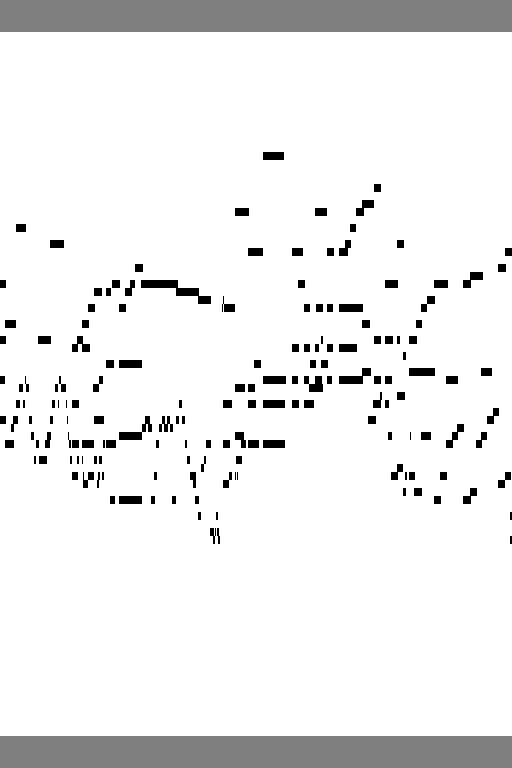
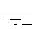
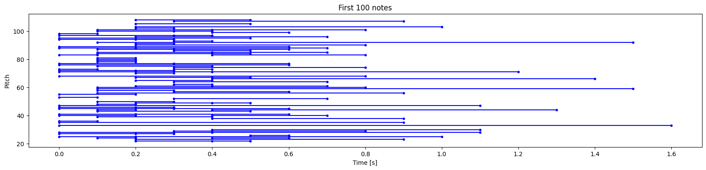
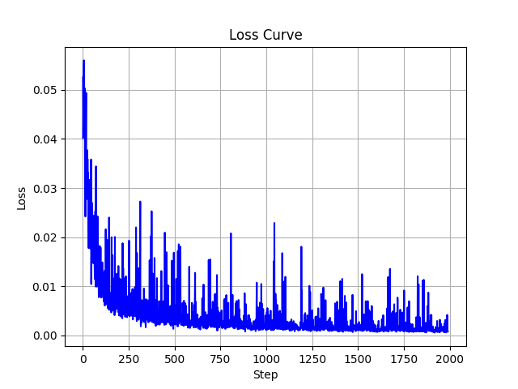
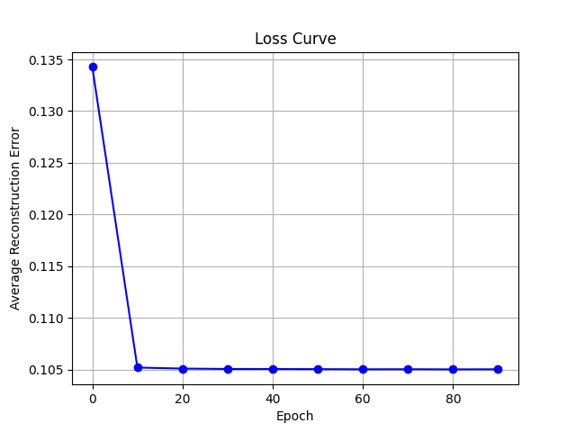

# 2. Stable diffusion & Restricted Boltzmann Machine(RBM)

## 2.1.**Stable Diffusion**

The **Stable Diffusion model** is employed as an advanced generative framework to create **roll plots** from MIDI (Musical Instrument Digital Interface) files. These MIDI files encapsulate detailed musical information such as notes, dynamics, timing, and instrumentation, formatted as symbolic data. The resulting roll plots provide a visual representation of this information, offering researchers and musicians an intuitive method to analyze and interpret musical compositions.

## 2.2.**Restricted Boltzmann Machine (RBM)**

The **Restricted Boltzmann Machine (RBM)**, a probabilistic generative model with a bidirectional layer architecture, is identified as a tool for enhancing roll plot images. Given the structured nature of the roll plots, the pixels are conceptualized as visible nodes in the RBM framework. This enables a denoising technique aimed at improving the **clarity and smoothness** of the plots. 

This integration of **Stable Diffusion** for generation and **RBM** for refinement demonstrates an innovative methodology to advance musical visualization techniques.

## 2.3.**Preprocessing Roll Plots**

The **Stable Diffusion model** requires input images with specific dimensions, necessitating preprocessing of the roll plots to align with these constraints. Key preprocessing steps include:

1. **Temporal Truncation**:
   - Original roll plots, with a 0.1-second time resolution, were truncated to 51.2 seconds to prevent memory limitations.
   - This truncation results in a plot width of 512 pixels, matching the model’s preferred input dimensions.
2. **Pitch Range Adjustment**:
   - The dataset's pitch range, initially spanning indexes 21 to 108, was extended to 17–112 for architectural compatibility.
   - This adjustment creates a pitch range of 96 values, a multiple of 16, optimizing it for neural network processing.
3. **Height Normalization**:
   - To achieve the required height of 768 pixels, each original row was replicated eight times.
   - This technique retains critical musical structure while adapting the plot dimensions for the model.

#### **Preprocessing Roll Plots for Restricted Boltzmann Machine (RBM)**

For the **RBM model**, roll plots are resized to **88 × 64 pixels**, aligning with the visible nodes in the RBM’s architecture. The compact dimensions ensure an efficient yet informative representation of musical data.

#### **Visual Encoding Strategies**

Two distinct color-coding approaches were implemented to enhance information density and alignment with model requirements:

1. **Stable Diffusion Roll Plots**:
   - **Black (RGB: 0, 0, 0)**: Indicates the presence of a musical pitch.
   - **White (RGB: 255, 255, 255)**: Represents pitch absence.
   - **Middle Gray (RGB: 127, 127, 127)**: Marks additional pitch indexes introduced during preprocessing, enriching contextual information for the model.
2. **RBM Roll Plots**:
   - Grayscale encoding with binary mapping.
   - **Black (0)**: Depicts pitch presence, mapped to 1 during loading.
   - **White (255)**: Indicates pitch absence, mapped to 0 during loading.

|  |  |
| ------------------------------------------------------------ |------------------------------------------------------------------------------------|
| Roll plot for Stable Diffusion                               | Piano Roll for RBM                                                                 |


## 2.4.Music Generation [Sample .WAV](wav_samples/SD_RBM_sample.wav)

After generating the roll plots, a normalization threshold of -0.8 is applied. Pixels are set to 1 if the average value across 3 channels falls below this threshold. Extra preprocessing lines are removed, and every 8 rows are combined: if any column in the 8-row group contains a 1, the group is retained. Following conversion, the plots undergo denoising via the Restricted Boltzmann Machine (RBM). Figure displays the first 100 generated notes, with roll plots subsequently converted to MIDI files and then to .WAV audio files.
<figure style="text-align: center;">
  
  <figcaption style="text-align: center;">Generated Spectrum Plot of 100 Notes</figcaption>
</figure>

## 2.5.Training Loss
|  |  |
|------------------------------------------------------|------------------------------------------------|
| Training Loss of the Stable Diffusion                | Training Loss of the RBM                       |

## **2.6.Run**

#### **Generate the Roll Plots for training**

```bash
python SD_process.py
python RBM_process.py
```

#### **Training**

```bash
python SD_train.py
python RBM_train.py
```

#### **Convert the Roll plots into the MIDI&WAV files**

```bash
python convert.py
```

